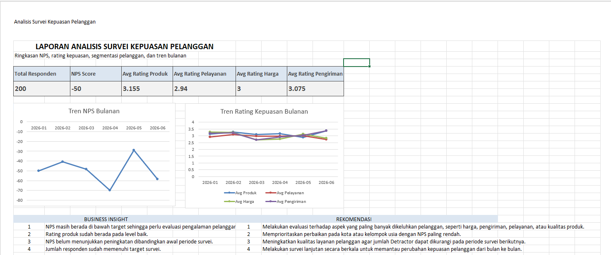
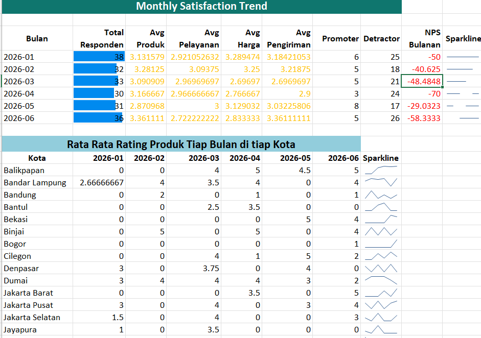
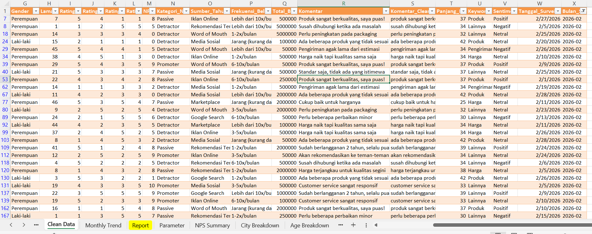

# Customer Satisfaction Survey Analysis with Excel

## Project Description

This project analyzes customer satisfaction survey data using Microsoft Excel. The objective is to transform raw survey responses into a clean, structured, and presentation-ready report that provides insights into customer satisfaction, Net Promoter Score (NPS), rating performance, customer segments, and monthly satisfaction trends.

The dataset contains 200 dummy customer survey responses with demographic information, rating scores, NPS scores, customer comments, survey dates, and monthly periods. The raw data is cleaned using Power Query, then analyzed using Excel formulas, summary tables, sparklines, and visual reports.

## Project Objectives

The main objectives of this project are:

1. Clean and prepare raw customer survey data using Power Query.
2. Calculate customer satisfaction metrics such as average rating and NPS Score.
3. Analyze satisfaction levels by city and age group.
4. Identify monthly satisfaction trends using survey date and monthly period.
5. Summarize customer comments using basic text functions.
6. Build a printable report that is ready for presentation.

## Tools and Features Used

* Microsoft Excel
* Power Query
* COUNTIF / COUNTIFS
* SUMIF
* AVERAGEIF / AVERAGEIFS
* Text Functions
* Named Ranges
* Sparklines
* Conditional Formatting
* Line Chart
* Printable Report Layout

## Skills Demonstrated

| Skill                  | Implementation                                                                               |
| ---------------------- | -------------------------------------------------------------------------------------------- |
| Power Query            | Cleaning raw survey data, removing duplicates, standardizing text, and formatting data types |
| COUNTIF / COUNTIFS     | Calculating Promoter, Passive, and Detractor segments                                        |
| SUMIF                  | Calculating total customer spending by city and age group                                    |
| Text Functions         | Cleaning comments and classifying keywords from customer feedback                            |
| Named Ranges           | Creating reusable targets such as Target_NPS and Target_Rating                               |
| Sparklines             | Displaying mini trends for monthly satisfaction data                                         |
| Conditional Formatting | Highlighting performance values below target                                                 |
| Report Design          | Creating a structured and printable customer satisfaction report                             |

## Workbook Structure

The Excel workbook consists of the following sheets:

| Sheet            | Description                                                                          |
| ---------------- | ------------------------------------------------------------------------------------ |
| `Survey Raw`     | Contains the original dummy survey data from 200 respondents                         |
| `Clean Data`     | Contains the cleaned data generated from Power Query                                 |
| `Monthly Trend`  | Contains monthly trend analysis for ratings, NPS, and city-based trends              |
| `NPS Summary`    | Contains the overall NPS calculation and satisfaction summary                        |
| `City Breakdown` | Contains customer satisfaction analysis by city                                      |
| `Age Breakdown`  | Contains customer satisfaction analysis by age group                                 |
| `Parameter`      | Contains target values and named ranges                                              |
| `Report`         | Contains the final printable report with KPIs, charts, insights, and recommendations |

## Dataset Structure

The dataset includes the following main columns:

| Column                  | Description                                   |
| ----------------------- | --------------------------------------------- |
| `Respondent_ID`         | Unique ID for each respondent                 |
| `Nama`                  | Respondent name                               |
| `Usia`                  | Respondent age                                |
| `Kelompok_Usia`         | Age group category                            |
| `Kota`                  | Respondent city                               |
| `Gender`                | Respondent gender                             |
| `Rating_Produk`         | Product rating on a scale of 1 to 5           |
| `Rating_Pelayanan`      | Service rating on a scale of 1 to 5           |
| `Rating_Harga`          | Price rating on a scale of 1 to 5             |
| `Rating_Pengiriman`     | Delivery rating on a scale of 1 to 5          |
| `NPS_Score`             | Recommendation score on a scale of 0 to 10    |
| `Kategori_NPS`          | NPS category: Promoter, Passive, or Detractor |
| `Total_Belanja_Setahun` | Customer annual spending                      |
| `Komentar`              | Open-ended customer feedback                  |
| `Tanggal_Survei`        | Survey completion date                        |
| `Bulan_Survei`          | Survey month in yyyy-mm format                |

## Data Cleaning Process

The raw survey data was cleaned using Power Query. The cleaning process includes:

1. Removing duplicate respondent records.
2. Standardizing text format for name, city, gender, and comments.
3. Applying `Trim` and `Clean` transformations to remove extra spaces and unwanted characters.
4. Converting each column into the correct data type.
5. Creating a clean and structured table for analysis.

The cleaned data is loaded into the `Clean Data` sheet and used as the main source for analysis.

## Key Formulas Used

### 1. Clean Customer Comments

```excel
=LOWER(TRIM(CLEAN([@Komentar])))
```

This formula standardizes customer comments by converting text to lowercase and removing unnecessary spaces or hidden characters.

### 2. Comment Length

```excel
=LEN([@Komentar_Clean])
```

This formula calculates the length of each customer comment.

### 3. Keyword Classification

```excel
=IF(ISNUMBER(SEARCH("harga",S2)),"Harga",IF(ISNUMBER(SEARCH("pengiriman",S2)),"Pengiriman",IF(ISNUMBER(SEARCH("pelayanan",S2)),"Pelayanan",IF(ISNUMBER(SEARCH("produk",S2)),"Produk","Lainnya"))))
```

This formula classifies customer comments based on the main keyword found in the text.

### 4. Simple Sentiment Classification

```excel
=IF(OR(ISNUMBER(SEARCH("puas",S2)),ISNUMBER(SEARCH("bagus",S2)),ISNUMBER(SEARCH("cepat",S2)),ISNUMBER(SEARCH("aman",S2))),"Positif",IF(OR(ISNUMBER(SEARCH("mahal",S2)),ISNUMBER(SEARCH("lama",S2)),ISNUMBER(SEARCH("buruk",S2)),ISNUMBER(SEARCH("susah",S2)),ISNUMBER(SEARCH("ribet",S2)),ISNUMBER(SEARCH("perbaikan",S2))),"Negatif","Netral"))
```

This formula provides a simple rule-based sentiment classification from customer comments.

### 5. Count Promoters

```excel
=COUNTIF(tbl_survey_clean[Kategori_NPS],"Promoter")
```

This formula counts the number of Promoter respondents.

### 6. Count Detractors

```excel
=COUNTIF(tbl_survey_clean[Kategori_NPS],"Detractor")
```

This formula counts the number of Detractor respondents.

### 7. Calculate NPS Score

```excel
=ROUND(((COUNTIF(tbl_survey_clean[Kategori_NPS],"Promoter")-COUNTIF(tbl_survey_clean[Kategori_NPS],"Detractor"))/COUNTA(tbl_survey_clean[Respondent_ID]))*100,0)
```

This formula calculates the Net Promoter Score by subtracting the percentage of Detractors from the percentage of Promoters.

### 8. Average Rating by Month

```excel
=AVERAGEIF(tbl_survey_clean[Bulan_Survei],A4,tbl_survey_clean[Rating_Produk])
```

This formula calculates the average product rating for each survey month.

### 9. Average Rating by City and Month

```excel
=IFERROR(AVERAGEIFS(tbl_survey_clean[Rating_Produk],tbl_survey_clean[Kota],$A13,tbl_survey_clean[Bulan_Survei],B$12),0)
```

This formula calculates the average product rating for each city by month.

### 10. Total Spending by Segment

```excel
=SUMIF(tbl_survey_clean[Kota],A2,tbl_survey_clean[Total_Belanja_Setahun])
```

This formula calculates total customer spending by city.

## NPS Calculation

The NPS calculation is based on the following categories:

| NPS Score Range | Category  |
| --------------- | --------- |
| 9–10            | Promoter  |
| 7–8             | Passive   |
| 0–6             | Detractor |

The NPS formula is:

```text
NPS = % Promoter - % Detractor
```

In this project, the NPS Score is calculated using Excel formulas based on the number of Promoters and Detractors in the cleaned survey data.

## Main Analysis

### 1. Overall Satisfaction Summary

The project calculates the overall customer satisfaction performance using:

* Total respondents
* NPS Score
* Average product rating
* Average service rating
* Average price rating
* Average delivery rating

These metrics are displayed in the final report as KPI cards.

### 2. Monthly Satisfaction Trend

The `Monthly Trend` sheet analyzes satisfaction performance by survey month. The analysis includes:

* Total respondents per month
* Average product rating per month
* Average service rating per month
* Average price rating per month
* Average delivery rating per month
* Monthly Promoter and Detractor count
* Monthly NPS Score

This section helps identify whether customer satisfaction improves or declines over time.

### 3. City-Based Satisfaction Analysis

The project also analyzes satisfaction by city. This breakdown helps identify cities with stronger or weaker customer satisfaction performance.

The city analysis includes:

* Total respondents by city
* Average rating by city
* Promoter and Detractor count by city
* City-level NPS Score
* Monthly rating trend by city

### 4. Age Group Analysis

The age group analysis compares satisfaction levels across different customer age segments. This helps identify whether certain age groups have different perceptions of product quality, service, price, or delivery.

### 5. Customer Comment Analysis

Customer comments are analyzed using basic text functions. The comments are cleaned and classified into several keyword categories, such as:

* Harga
* Pengiriman
* Pelayanan
* Produk
* Lainnya

A simple sentiment category is also created to classify comments into positive, negative, or neutral feedback.

## Dashboard and Report Preview

### Final Report Preview



### Monthly Trend Preview



### Clean Data Preview



## Business Insights

Based on the survey analysis, customer satisfaction can be evaluated through a combination of NPS Score, rating performance, city segmentation, age group segmentation, and customer comments.

In the current dummy dataset, the NPS Score is negative, which indicates that the number of Detractors is higher than the number of Promoters. This suggests that customer loyalty still needs improvement, especially in areas frequently mentioned in customer comments.

The average rating values show that customer satisfaction is generally at a moderate level. Product, service, price, and delivery aspects should be evaluated further to identify which area contributes most to customer dissatisfaction.

The monthly trend analysis helps monitor changes in satisfaction over time. If the NPS Score remains negative across several months, the company should prioritize improvements in customer experience and service quality.

The city and age group breakdowns provide additional insights into which customer segments require more attention. Segments with low ratings or negative NPS values can be prioritized for further investigation and improvement.

## Business Recommendations

Based on the analysis, the following recommendations can be considered:

1. Evaluate the main causes of dissatisfaction based on customer comments, especially issues related to price, delivery, service, or product quality.
2. Prioritize improvement for cities or customer segments with low satisfaction scores.
3. Reduce the number of Detractors by improving service responsiveness and customer support quality.
4. Monitor NPS and rating trends monthly to evaluate whether customer satisfaction improves over time.
5. Conduct regular customer surveys to track changes in satisfaction and customer loyalty.

## Final Output

The final output of this project is a structured Excel report that can be used for customer satisfaction monitoring and business presentation. The report includes:

* Cleaned survey data
* NPS summary
* Monthly satisfaction trend
* City-based satisfaction breakdown
* Age group satisfaction breakdown
* Sparklines for mini trend visualization
* Printable report with KPI cards, charts, insights, and recommendations

## Conclusion

This project demonstrates the ability to clean, analyze, summarize, and present customer survey data using Microsoft Excel. It applies data cleaning with Power Query, metric calculation using Excel formulas, customer segmentation, monthly trend analysis, and printable report design.

This project is suitable for a Data Analyst portfolio because it covers the end-to-end process of data preparation, data analysis, visualization, insight generation, and business reporting.
